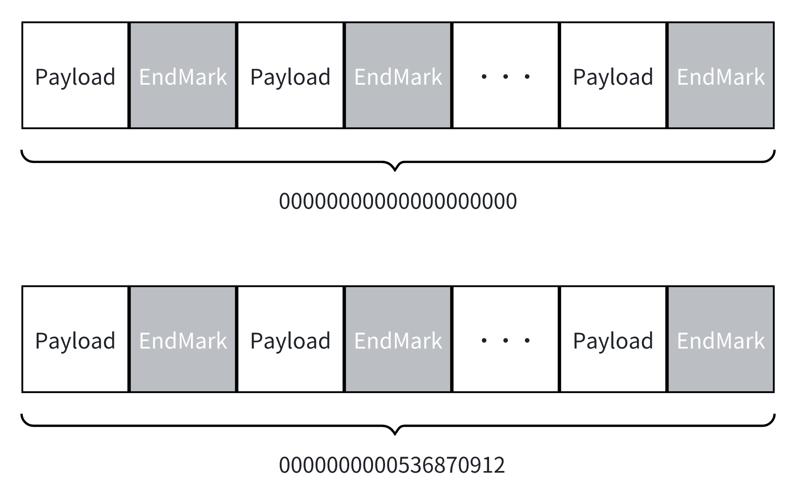

MappedFileQueues
=================

[](https://codecov.io/gh/eventhorizon-cli/MappedFileQueues)
[](https://www.nuget.org/packages/MappedFileQueues/)

English | [简体中文](./README.zh-CN.md)

**MappedFileQueues** 是一个基于内存映射文件（Memory-Mapped Files）的高性能队列，专为进程间通信（IPC）设计。

为了最大化数据传输效率，MappedFileQueues 仅支持传递值类型数据。如果你需要传递自定义引用类型的数据，可以参考项目 [MappedFileQueues.Stream](https://github.com/eventhorizon-cli/MappedFileQueues.Stream)。

### 设计概述

MappedFileQueues 通过内存映射文件来持久存储数据，整体结构分为若干个 Segment，每个 Segment 内又包含多个 Message。

- **Message**：每个消息由 Payload 和 EndMarker（结束标记）组成。
- **Segment**：Segment 的大小可配置。系统会自动调整 Segment 的实际大小，使其不超过配置的 SegmentSize，并且能够容纳整数倍数量的 Message。



每个 Segment 的文件名为该段中第一个 Message 的 offset，并以 0 补足到 20 位。例如，`0000000000536870912` 表示该 Segment 从 offset 为 536870912 的位置开始。

- Message 的写入以 byte 为单位计数，每写入 1 byte，offset 加 1。
- 例如，offset 为 1024 时，表示之前已写入了 1024 字节的数据。

offset 使用 long 类型存储，支持的最大值为 2^63-1。

为简化设计，MappedFileQueues 并没有处理 offset 的溢出问题。理论允许写入的最大数据量为 2^63-1 字节（约 8 EB）。在实际应用中，通常不会达到这个极限。

如果确实需要处理比这个极限更大的数据量，可以考虑定期修改 StorePath（存储路径）或使用多个 MappedFileQueues 实例来分散数据。

为保证性能，当没有可消费数据时，Consumer 会先自旋等待，单次自旋等待的最长时间可通过配置项 ConsumerSpinWaitDuration 设置，默认值为 100 毫秒。若超时仍无数据，消费者将进入休眠状态，休眠时长由 ConsumerRetryInterval 控制，默认值为 1 秒。

### 存储目录

通过 `StorePath` 配置项指定的存储路径下，MappedFileQueues 会创建以下目录结构：

```bash
├── commitlog
│   ├── 000000000000000000000
│   ├── 000000000000000001024
│   └── ...
├── offset
│   ├── producer.offset
│   └── consumer.offset
```

其中：

- `commitlog` 目录存储实际的 Segment 文件。

- `offset` 目录存储生产者和消费者的偏移量文件。

### 使用示例

#### 配置选项（MappedFileQueueOptions）

- **StorePath**：存储路径，必须是一个有效的文件夹路径。

- **SegmentSize**：每个 Segment 的大小，系统会自动调整 Segment 的实际大小，使其不超过配置的 SegmentSize，并且能够容纳整数倍数量的 Message。

- **ConsumerRetryInterval**：消费者在没有数据可消费时的重试间隔，默认为 1 秒。

- **ConsumerSpinWaitDuration**：消费者单次自旋等待数据时的最大等待时间，默认为 100 毫秒。

#### 生产和消费数据

MappedFileQueues 中的生产者和消费者接口如下所示：

```csharp
public interface IMappedFileProducer<T> where T : struct
{
    // 用于观察当前生产者的下一个可写入的偏移量
    public long NextOffset { get; }

    public void Produce(ref T item);
}

public interface IMappedFileConsumer<T> where T : struct
{
    // 用于观察当前消费者的下一个需要消费的偏移量
    public long NextOffset { get; }

    public T Consume();

    public void Commit();
}
```

以下是一个简单的使用示例：

定义结构体：

```csharp
public unsafe struct TestStruct
{
    public int IntValue;
    public long LongValue;
    public double DoubleValue;
    public fixed char StringValue[20]; // 最大支持20个字符
}
```

创建 MappedFileQueues 实例获取单例的生产者和消费者，并进行数据的生产和消费：

```csharp
var storePath = "test"; // 存储路径

// 如果已经跑过测试，先先删除之前的数据
if (Directory.Exists(storePath))
{
    Directory.Delete(storePath, true);
}

var queue = MappedFileQueue.Create<TestStruct>(new MappedFileQueueOptions
{
    StorePath = storePath,
    SegmentSize = 512 * 1024 * 1024 // 512 MB
});

var producer = queue.Producer;

var consumer = queue.Consumer;

var produceTask = Task.Run(() =>
{
    for (var i = 0; i < 100; i++)
    {
        var testStruct = new TestStruct
        {
            IntValue = i,
            LongValue = i * 10,
            DoubleValue = i / 2.0,
        };

        // 如果你想在结构体中使用字符串，可以使用以下方法将其转换为 fixed 数组
        var testString = "TestString" + i;
        fixed (char* fixedChar = testString)
        {
            Unsafe.CopyBlock(testStruct.StringValue, fixedChar, sizeof(char) * (uint)testString.Length);
        }

        producer.Produce(ref testStruct);
    }

    Console.WriteLine("Produced 100 items.");
});

var consumeTask = Task.Run(() =>
{
    for (var i = 0; i < 100; i++)
    {
        var testStruct = consumer.Consume<TestStruct>();
        Console.WriteLine($"Consumed: IntValue={testStruct.IntValue}, LongValue={testStruct.LongValue}, DoubleValue={testStruct.DoubleValue}");

        // 如果你想在结构体中使用字符串，可以使用以下方法将 fixed 数组转换回托管字符串
        unsafe
        {
            string? managedString = ToManagedString(testStruct.StringValue, 20);
            Console.WriteLine($"StringValue: {managedString}");
        }
    }

    Console.WriteLine("Consumed 100 items.");
});

await Task.WhenAll(produceTask, consumeTask);


// 如果你想在结构体中使用字符串，可以使用以下方法将其转换回托管字符串
unsafe string? ToManagedString(char* source, int maxLength)
{
    if (source == null)
    {
        return null;
    }

    int length = 0;
    while (length < maxLength && source[length] != '\0')
    {
        length++;
    }

    return new string(source, 0, length);
}
```
